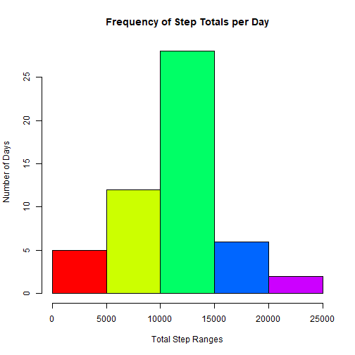
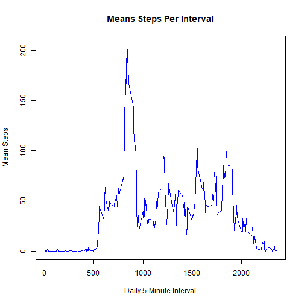
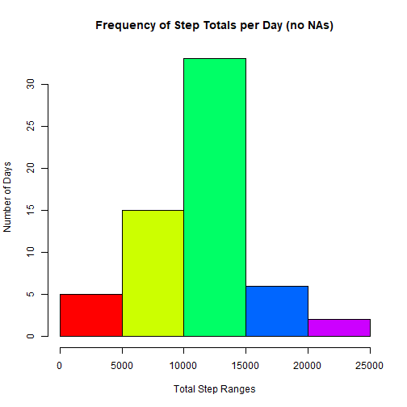

This assignment seeks to answer a set of question with regards to a single dataset.  This dataset pertains to activity data over a two month period of an anonymous individual.  The data represents the total steps taken in 5-minute intervals.
The data is structured as so:

*  steps: Number of steps taking in a 5-minute interval (missing values are coded as \color{red}{\verb|NA|}NA)
*  date: The date on which the measurement was taken in YYYY-MM-DD format
*  interval: Identifier for the 5-minute interval in which measurement was taken

## Loading and preprocessing the data
The following code downloads the zip file, unpacks it, and reads into the data.frame activity.  It also converts the data column to a date data type.  This was largely unnecessary as the zip was in the forked repository but I like to have the code do everything.


```r
suppressMessages(library(dplyr))
library(dplyr)
url <- "https://d396qusza40orc.cloudfront.net/repdata%2Fdata%2Factivity.zip"
file <- "repdata data activity.zip"
if(!file.exists(file)) {
      download.file(url, file, mode="wb")
}
path <- ""
if(!file.exists(path)) {
      unzip(file)
}
activity <- read.csv("activity.csv")
activity$date <- as.Date(activity$date, format="%Y-%m-%d") 
```


## What is mean total number of steps taken per day?
To calculate the mean total number of steps taken per day, we'll first aggregate the data while removing the NA steps values.  This provides a basis for our mean and median calculations and a dataset for generating a histogram.

```r
stepsPerDay <- aggregate(steps ~ date, data=activity, rm.NA = TRUE, FUN = sum) 
```
Now let's take a look at the distribution of the total number of steps take per day

```r
hist(stepsPerDay$steps, main="Frequency of Step Totals per Day", xlab="Total Step Ranges", ylab="Number of Days",
     col = rainbow(5))
```



From the aggregated dataset we can calculate the mean total number of steps per day

```r
mean(stepsPerDay$steps)
```

```
## [1] 10767.19
```
We can also calculate the median total number of steps per day

```r
median(stepsPerDay$steps)
```

```
## [1] 10766
```

## What is the average daily activity pattern?
We can make time series plot (i.e. \color{red}{\verb|type = "l"|}type="l") of the 5-minute interval (x-axis) and the average number of steps taken, averaged across all days (y-axis) to help answer the question of the average daily activity pattern.

```r
meanStepsPerInterval <- aggregate(steps ~ interval, data=activity, rm.NA = TRUE, FUN = mean)
plot(meanStepsPerInterval$interval, meanStepsPerInterval$steps, type = "l",
     main = "Means Steps Per Interval", xlab = "Daily 5-Minute Interval", ylab="Mean Steps",
     col = "blue")
```



From this plot we can see that the interval containing the max average steps is in the 700-900 minute range.
With a simple call to which.max we can see that exact interval which contains the msiximum average daily steps.

```r
meanStepsPerInterval[which.max(meanStepsPerInterval$steps), ]
```

```
##     interval    steps
## 104      835 206.1698
```


## Imputing missing values
Up until this point, we have been using the dataset as-is.  The dataset contains 2304 entries which have an NA for steps for the date-interval pair.  The exact number is shown by the following:

```r
sum(is.na(activity$steps))
```

```
## [1] 2304
```
To impute these missing values, we are going to employ a strategy of substituting the average steps for a given week day for the missing value.  An example would be if we had a missing value for a Monday we would substitute the average steps for all Mondays for the missing value.  The following code accomplishes this.

```r
activity$weekday <- weekdays(activity$date)
meanStepsDay <- aggregate(steps ~ weekday, data=activity, rm.NA = TRUE, FUN=mean)
activity$replace <- as.numeric(as.character(factor(activity$weekday, levels=meanStepsDay$weekday, labels=meanStepsDay$steps)))
activity$steps <- ifelse(is.na(activity$steps), activity$replace, activity$steps)
stepsPerDay <- aggregate(steps ~ date, data=activity, rm.NA = TRUE, FUN = sum)
```
The missing values are now replaced with the average steps for the given day.  We can now see that there is a very slight difference in the frequency of daily average steps by the following histogram.

```r
hist(stepsPerDay$steps, main="Frequency of Step Totals per Day (no NAs)", xlab="Total Step Ranges", ylab="Number of Days",
     col = rainbow(5))
```



The histogram is not a very good indicator of the mean daily average change by imputing the missing values but looking at the new mean and median shows the increase by replacing the missing values.

```r
mean(stepsPerDay$steps)
```

```
## [1] 10822.21
```

```r
median(stepsPerDay$steps)
```

```
## [1] 11016
```


## Are there differences in activity patterns between weekdays and weekends?
To determine if there is a difference between weekdays and weekends with regards to activity pattern, we'll first create a new column indicating whether a new row is a weekday or weekend.

```r
activity$dayType <- as.factor(ifelse(activity$weekday %in% c("Saturday", "Sunday"), "weekend", "weekday"))
```
Using this new factor variable, we'll calculate the average steps per interval for both weekends and weekdays to differentiate between the two patterns

```r
meanStepsPerIntervalWeekend <- aggregate(steps ~ interval, data=activity[activity$dayType=="weekend", ], rm.NA = TRUE, FUN = mean)
meanStepsPerIntervalWeekday <- aggregate(steps ~ interval, data=activity[activity$dayType=="weekday", ], rm.NA = TRUE, FUN = mean)
```
With these aggregations we can plot them side by side to see the difference

```r
par(mfrow = c(2,1))
plot(meanStepsPerIntervalWeekend$interval, meanStepsPerIntervalWeekend$steps, type = "l",
     main = "Means Steps Per Interval (Weekend)", xlab = "Daily 5-Minute Interval", ylab="Mean Steps",
     col = "blue")
plot(meanStepsPerIntervalWeekday$interval, meanStepsPerIntervalWeekday$steps, type = "l",
     main = "Means Steps Per Interval (Weekday)", xlab = "Daily 5-Minute Interval", ylab="Mean Steps",
     col = "red")
```


As you can see, weekdays have a higher max value in the moring but weekends have a more consistent level of steps throughout the day.
